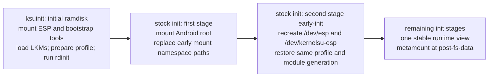

# KernelSU ESP re-fork: three repositories, optional ESP mode, writable views

## Status and scope

This is the revised implementation plan, not a record of completed implementation. It replaces the previous RO-ESP, copy-to-userdata design. This edit does not rename local directories or GitHub repositories, create the refork, flash a device, or remove upstream components.

Repository names:

- `kernelsu-esp`: upstream-close KernelSU, including `kernel/`, `userspace/ksud`, `userspace/ksuinit`, Manager, website, JS library, and their normal workflows.
- `kernelsu-esp_modules`: ESP modules, platform/storage policy, Android userspace tools, and platform packaging.
- `kernelsu-esp_lkms`: independently consumable real Linux kernel modules, their ABIs, and kernel build lanes.

The present `kernelesp` checkout is the legacy port source. Freeze its actual current state before implementing; do not use the old plan's stale file counts as a commit specification. Base the new branch on upstream `v3.3.0` (`932014ab`). Sibling reconciliation in gobbl, efivar-store, generic-bootctl, and gobbl-lab remains in scope. Breaking changes are acceptable: update every consumer in the cutover, without compatibility aliases.

## Decisions

### Keep upstream; add one global ESP mode

Do not delete Manager, website, JS, upstream installers, or upstream boot-patching support. ESP mode is an additional backend selected through the same global setting in Manager and ksud. Disabled means normal upstream behavior, including `/data/adb/modules` and `/data/adb/ksud`. Enabled means one ESP-aware daemon owns module operations, stage dispatch, and the metamodule for that boot. Changing the setting takes effect on the next boot; do not switch mounted roots underneath running services.

The persistent mode setting must be available before `/data` exists: store it with the ESP configuration, not solely in Manager preferences or userdata. A takeover cpio can carry the initial setting for provisioning; thereafter Manager and ksud update the same ESP setting. An explicit takeover for a managed ROM cannot silently fall back to stock when its required storage is unavailable.

An executable named `ksud` elsewhere on PATH is not proof of conflict, and a binary does not need to be running to own later init stages. Resolve the stock daemon path, existing init dispatch, and loaded KernelSU backend before enabling. Refuse activation when another independent installation would dispatch its own ksud or root hook owner. Do not delete or overwrite that installation. A single daemon serving both ordinary KernelSU features and ESP mode is supported; two independent root stacks are not.

### Naming and namespaces

Keep `kernelsu.ko`, its internal kernel module name `kernelsu`, `ksud`, `ksuinit`, `ksu` / `ksu_file`, `[ksu_driver]`, and ioctl magic `'K'` as upstream names. Repository branding does not require renaming the ABI. Retain `/esuinit` only as the platform takeover entry until GBL/Surfacer and all cpio consumers migrate together; it contains the ksuinit binary, not a second PID-1 implementation.

`kernelsu.ko` can collide in an artifact directory, and two modules with internal name `kernelsu` cannot both load. More importantly, a renamed second module would still compete for root hooks, credentials, and stage dispatch. Use product-specific release directories and one backend per boot; changing the filename alone does not provide coexistence.

Product-owned paths are `/dev/esp/kernelsu-esp` for persistent ESP content and `/dev/kernelsu-esp` for the final runtime view. No `/dev/ksu` driver node is required. A temporary block-special node used to mount a partition is not the KernelSU ioctl interface. Avoid `/dev/ksu-esp` as a mixed-purpose name: use `/dev/block/kernelsu-esp` only if a temporary ESP block node is needed.

Keep upstream `ksu` policy names because the installations are mutually exclusive. Platform services retain their own domains, such as `esu_bootctl`, with module-owned `sepolicy.rule` files. Merely naming both daemons `ksud` does not create a process or SELinux namespace. Do not relabel every service into `ksu` to make denials disappear.

### RW defaults and overlay intensity

The raw ESP at `/dev/esp` is RW by default, with `nosuid,nodev,noexec`. Consumers do not restore it to RO after every write. Receipts, provisioning, OTA files, and package staging can write there. A writable ESP-file projection is no longer an exceptional remount case. FAT still lacks normal Unix permissions, symlinks, and per-file SELinux xattrs; RW does not repair those limitations.

The effective module view is also RW. Use an ext4 filesystem on an LV for OverlayFS uppers and workdirs; an LV is a block device, not itself a filesystem. The storage provider activates and mounts it before the effective modules execute. Each overlay has a distinct upper and initially empty workdir on the same filesystem. Never share an active upper/work pair between ROMs or mounts.

Start with **module-tree overlays**, not an overlay of `/`, `/data`, or every Android partition. Keep magic mount as the projection of module `system/` content onto Android. This makes module homes and their projected files writable without rewriting AVB-backed lower images. It does not make all untouched `/system` files writable. Whole-partition writable system overlays would be a separate, explicitly selected intensity level, with a ROM/base-image generation key; they are not implied by mounting the ESP RW.

The selected metamodule currently remounts projected file binds RO. ESP mode must remove that RO remount for files backed by the writable effective module tree, while retaining stock behavior when ESP mode is off. Writes through those file binds then reach the module upper. New files in a temporary magic-mount skeleton are not automatically persistent: write durable additions in the module `system/` tree, then rebuild the projection at the next mount cycle.

### Shared packages; per-ROM writable state

EFI variables already identify the booted ROM and its boot/OTA state. Use that identity to select storage; do not introduce another competing ROM-identity manifest or a new variable protocol in generic KernelSU.

Packages on the ESP are shared across ROMs by default. Writable module overrides, local installs, disable/remove preferences, metamodule configuration, and persistent module state are per ROM. The generic backend treats the selected profile as an opaque key supplied by the platform storage provider; it does not depend on esu-vars, LVM, BCB, or a gobbl manifest.

An explicitly selected `shared` profile allows all-ROM state. It is not the default: Android API levels, module binaries, SELinux policy, and config can differ. ROM slots of the same ROM use the same stable ROM profile; slots are not separate users. Recovery uses the profile selected by the platform and admits only recovery-compatible modules. Platform/lab content is separate from ordinary user-installed modules.

### Lower-layer updates: replace, do not blindly rebase

Neither OverlayFS nor magic mount merges an updated package with user changes:

- A copied-up file continues to hide the corresponding new lower file.
- A whiteout continues to hide a name reintroduced in the new lower.
- An opaque upper directory continues to hide new lower children.
- A module-projected file continues to hide a changed Android file until the module's own content changes or its projection is disabled.

Changing lower contents behind a mounted overlay is unsupported. RW access to the ESP does not authorize editing an active package lower. Stage updates in `modules_update/`; activate them only before mounting the next boot's module overlays. Leave boot images and unrelated writable ESP content outside the package lower trees.

Use one overlay per shared module, with upper/work directories keyed by ROM profile, module ID, and **package generation**. A package generation identifies the actual packaged tree, not merely a mutable `versionCode`. On a package replacement, mount a fresh upper/work pair for that module. Do not copy the old upper, whiteouts, opaque markers, or OverlayFS internals into the fresh pair. Unchanged modules keep their existing uppers. Retain the old lower and upper as an inactive rollback pair; do not automatically delete user edits.

Keep durable state under the LV's `state/<id>/` and preferences outside disposable package uppers. Expose a stable `KSU_MODULE_STATE` path. Modules that historically store config beside their binary can keep working in the upper, but those writes are generation-local. Package upgrades must use that module's explicit config migration, or require the user to select old config from the retained generation. No generic text merge, stale-binary preservation, or silent discard of old edits.

Locally installed modules are ordinary writable directories on the profile LV, not another lower requiring copy-up. An ID exists in either shared packages or local installs, not both. Treat replacement as an explicit package/local ownership change, not precedence by directory scan order.

Use conservative OverlayFS options (`index=off,metacopy=off,xino=off,redirect_dir=nofollow` where supported by the target GKI). Fresh upper generations remain the update rule even with those options. No feature option makes arbitrary lower rebasing safe. Unsupported required options are a build/runtime compatibility issue to resolve against the target kernel, not a reason to silently use a different update model.

### ESP and LV layout

Module directories are interpreted as installed. Their presence and `module.prop` identify them; the gobbl manifest does not repeat their membership. A nested product root separates packages, users, and lab accommodations without inventing a second module format.

```text
ESP/
  EFI/                                  firmware boot assets, unchanged
  kernelsu-esp/
    config.toml                         global ESP mode and storage-provider config
    bin/{ksud,busybox}                   bootstrap inputs
    modules/<id>/                       installed package layout, frozen while mounted
      module.prop
      system/{bin,etc,...}
      rd/{bin,etc,...}
      rdinit.sh
      early-init.sh / init.sh / early-fs.sh / post-fs.sh
      post-fs-data.sh / service.sh / boot-completed.sh
      initrc/*.rc
      sepolicy.rule
      kmod/<branch>-<generation>/*.ko
    modules_order                       ordering only, not a second inventory
    modules_update/<id>/                 staged replacement; never a live lower
    modules_previous/<id>/<generation>/  retained lower for rollback
    kmi/<branch>-<generation>/{lib/*.ko,set.json}
    receipts/
    lab/                                explicitly enabled lab payloads
  esu/{manifest.toml,roms/<id>.toml}      platform schema v2, no module inventory
  rom/<id>/{esu.cpio,esu.stage.cpio,...}  platform images and OTA assets

profile LV (ext4), mounted at /dev/kernelsu-esp/store:
  profiles/<rom-or-shared>/
    overlays/<id>/<package-generation>/{upper,work}
    modules/<id>/                       local/user-installed modules
    modules_update/<id>/                local installer staging
    state/<id>/                         durable module state
    preferences/                        enable/remove policy, independent of generation
    magic_mount/{config.toml,custom,...}

final runtime view:
  /dev/esp                              one RW raw ESP mount
  /dev/kernelsu-esp/
    bin/                                executable tmpfs copies
    source                              boot's selected source/profile descriptor
    store/                              mounted profile filesystem
    modules/<id>/                       RW package overlays or local-module binds
    state/<id>/                         binds to selected profile state
    metamodule                          selected module link on a Unix-capable fs
```

`modules_order` ranks discovered modules needed for deterministic bootstrap dependencies. Discover unlisted installed modules too, in stable ID order; a valid metamodule is not excluded just because it is unlisted. `lab/` is not scanned implicitly. The same effective module set drives rc, policy, scripts, and metamount; do not discover a new early-stage module after init has consumed the one-pass rc buffer.

Package activation renames the old installed directory into `modules_previous/` and the staged replacement into `modules/` before overlay mounts. Record activation state so interruption between those operations can be completed or rolled back on the next boot. Flush package data and metadata before advertising the new generation. FAT rename/fsync is not a transactional filesystem guarantee: include interruption testing rather than claiming atomic multi-directory replacement.

### Labels and executable files

A FAT lower does not acquire per-inode labels just because an ext4 upper exists. Early tools are copied into executable tmpfs. Before Android consumers bind or execute module `system/` exports, copy up the needed files and apply the package's normal permission/label preparation on the Unix-capable effective tree. With `metacopy=off`, metadata changes can copy file data: account for that storage cost rather than claiming zero-copy labels.

Run package customization when preparing a new effective generation, not by installing another copy into `/data/adb/modules`. Persist preparation completion with that generation; on failure do not expose a partially prepared module. Ordinary local installs retain upstream installer behavior on the LV. The metamodule reads the effective root and exports correctly prepared files. Prove access on an enforcing Android boot; blanket access to `vfat` is not a substitute.

### Mounts during the stage transition

The previous wording confused mount lifetimes with three persistent ESP locations. There is one raw ESP path. There are temporary execution views because Android replaces the initial root and recreates `/dev` and `/sys`.



ELI5: the first workbench is in the unpacked ramdisk. Android then replaces the room containing it. `early-init` rebuilds the workbench in the final room, at the same documented final paths. `/debug_ramdisk/kernelsu-esp` is only an optional carry/staging path when the target init transition needs it; it is not another ESP owner mount. `/dev/kernelsu-esp` is the final tools/module view; `/dev/esp` is the actual disk filesystem. Two temporary lifetimes plus one stable lifetime do not mean three disks or three lasting ESP mounts.

`exec /init` by itself does not destroy mounts. Loss occurs through Android's first-stage root transition and mount cleanup. Detach only mounts owned by ksuinit in reverse dependency order, after closing its scripts/cwds and copying the handoff descriptor/rc bytes into their actual handoff channels. Do not indiscriminately detach vendor mounts or assume an efivarfs mount survives detaching `/sys`. Loaded modules, device-mapper objects, and referenced loop backends survive as kernel objects; their pathnames and userspace FDs do not automatically survive.

Restore efivarfs in second stage at `/sys/firmware/efi/efivars`. For writable overlay workdirs, fully unmount the first-stage overlay before using its upper/work in the final view. `MNT_DETACH` alone is insufficient if a live reference keeps the old overlay mounted. Stage-transition integration must prove no overlapping active upper/work mount. Do not rebuild the final view after a service has already opened files from an earlier view.

This resembles Magisk's need to arrange work around first-stage init, but it does not require importing Magisk's implementation or three permanent mount paths.

### Input checks, not runtime self-attestation

`validate_module_id` is upstream identifier/path hygiene, not signature verification or a trust decision. In v3.3.0 it is exactly `^[a-zA-Z][a-zA-Z0-9._-]+$`: leading ASCII letter, then letters/digits/dot/underscore/hyphen; the `+` also excludes one-character IDs. Reuse it at install/input boundaries, rather than introducing another ESP-specific whitelist. Retain path confinement, duplicate ownership errors, and bounds needed to prevent an escaped copy or overflowing rc. Installed directories still need a readable `module.prop` with a matching ID. Presence is the inventory check; do not add a separate gobbl approval table or a blanket symlink-tampering policy for Unix-capable module trees. Confine paths without rejecting legitimate upstream symlinks.

Remove the proposed stage-by-stage mount-count/flag/context scans and per-inode label verification from ksud. The mounting code owns its mounts, checks syscall results, and reports failures of operations consumers actually need. Resolve ambiguous externally discovered disks and providers because choosing the wrong writable device is consequential. Keep GKI/KMI artifact admission because modules are binary inputs with a real compatibility contract. Integration tests verify new behavior; runtime does not repeatedly prove known construction steps.

### efivarfs and the variable-store backend

The standard path is **`/sys/firmware/efi/efivars`**, not `/sys/firmware/efi/efivarfs`. `efivarfs` is the filesystem type. Bootstrap `kernelsu`, `efivarfs`, and `efivar_store` before ESP consumers; this must work even when no managed-ROM manifest exists.

Use efivar_store's **existing** `partuuid=<unique-GPT-GUID>` interface, or its default `/chosen/efivar-store,partuuid` DT property published by Surfacer. This identifies the selected partition directly and avoids adding a new GPT lookup to generic KernelSU. `dev=<major>:<minor>` remains available for an explicitly resolved device; `dev` and `partuuid` are mutually exclusive. A label such as `bdsvars` is a provisioning label, not the authoritative selector. The old `dev=by-name:bdsvars` loader substitution is unnecessary when the canonical DT property is present.

The existing bdsvars type GUID is `4F68BCE3-E8CD-4DB1-96E7-FBCAF984B709`; its individual unique GUID/PARTUUID is provisioned per disk, not hardcoded. The EFI-variable vendor namespace is `7a5e4b1c-0d3f-4e62-9b8a-1c2d3e4f5a6b`; the EFVS firmware configuration-table GUID is `930e89ed-540e-4af0-9b41-c2c559939d50`. These four identifiers are not interchangeable, and the type GUID alone need not uniquely identify a disk. If a host/provider must discover a store, use the canonical selected PARTUUID and report ambiguity rather than choosing the first partition with a matching type or label.

In both GKI-LKM and mainline-DKMS efivar_store builds, create the standard EFI sysfs directory/mount point when needed. Track ownership for cleanup; never remove a pre-existing firmware EFI tree. An existing EFI tree is not evidence its `efivars` mount point exists. Handle creation/acquisition failures explicitly and release only acquired references. A mount-point directory existing is not the same as efivarfs being mounted there.

### KPM versus real LKMs

Borrow the useful metadata idiom, not KPM's hook chains, ELF loader, or CTL0 interface. These are ordinary `.ko` files, built against the selected ACK/DDK and admitted using their real kernel module contracts. A KPM module built against KernelPatch headers is not evidence of GKI/KMI compatibility for a `.ko`.

In the examined KernelPatch source, KPM does not offer the scoped I/O-credential enter/leave pair used here. It exposes credential primitives through `kfunc_def`/runtime symbol matching and provides SU credential APIs, which are different contracts. Notably, `override_creds` is matched in `kernel/patch/ksyms/misc.c`, while the `revert_creds` match is commented out: a declaration alone is not proof of a usable pair. Keep our own scoped provider.

KPM builds a relocatable `.kpm` using KernelPatch headers and a bare-metal compiler, with KernelPatch resolving its API symbols at load time; it does not use `Module.symvers`/vermagic as a normal `.ko` does. KernelPatch's separate LKM delivery path does use per-KMI DDK builds. Thus KPM does not extend or satisfy GKI/KMI checks for these real LKMs; use the main KernelSU ACK/DDK build model and exact-module admission here.

Keep the optional kernel credential-provider contract separate from KPM metadata. The legacy provider brackets backing-store file I/O with `override_creds(ksu_cred)` and `revert_creds(old)`. Export `ksu_io_cred_enter/leave` from kernelsu-esp; consumers resolve with `symbol_get`, balance `symbol_put`, and pair enter/leave within the same execution context. Missing provider means caller credentials, not a fake privileged credential. Document the consequences for enforcing Android callers.

Use `include/kernelsu_esp_lkm.h`, macros `KERNELSU_ESP_LKM_METADATA` / `KERNELSU_ESP_LKM_READY_PARAM`, and `.modinfo` keys `kernelsu_esp_name`, `kernelsu_esp_version`, `kernelsu_esp_abi`, `kernelsu_esp_critical`. This header contains no new loader or shared runtime. Independent module ABIs remain in their own `uapi/` or configfs documentation.

## Ordered implementation

P1-P3 can proceed independently after P0, subject to agreed interfaces above. P4 integrates them; P5 is an owner-controlled cutover. Each implementation task gets its own focused commit after the affected checks pass.

### P0. Freeze and name the repositories

1. Inspect current changes and commit only agreed legacy work; tag the resulting source `legacy-20261008`. The plan itself is not permission to sweep unrelated future changes into a snapshot. Push nothing without the owner's choice.
2. Create `refork` from upstream `v3.3.0`. Name the product repository `kernelsu-esp`; coordinate local path, remotes, CI artifact paths, sibling references, and GitHub rename. Do not rewrite old provenance paths as though the source had always used the new name.
3. Split legacy `modules/` history into `kernelsu-esp_lkms`. Keep one independent LKM per `kernel/<name>/` directory. Preserve the original source path and snapshot in provenance.
4. Split legacy `esu/` module history into `kernelsu-esp_modules`; bring in required crates/tools from the same snapshot with provenance. Move source and shipped layouts to the module contract below, not legacy source paths disguised as current artifacts.
5. Import the recorded generic-bootctl revision with history into `modules/gobbl-boot-hal/generic-bootctl`. Archiving its old remote remains the owner's decision.

### P1. kernelsu-esp: upstream plus generic enabling

6. Retain upstream components and workflows. Update project guides and product docs for the three repositories and global ESP mode. Do not remove ordinary installers or the stock boot flow.
7. Make the daemon path runtime-mode aware without two daemons: stock uses `/data/adb/ksud`; ESP uses `/dev/kernelsu-esp/bin/ksud` after final bootstrap. Ensure the kernel rc and exec hook use the same boot-selected path. Avoid the previous ESP-only compile flag that disabled the stock path in every ESP artifact.
8. Add the one-shot module-rc supplement ioctl. Keep the pointer/length/reserved UAPI, 64 KiB bound, root permission, copy-from-user handling, `EALREADY` on second supply, and `EBUSY` after consumption. Feed bootstrap rc plus admitted module rc bytes before stock init opens its rc; preserve `norc`. Pick the actual free ioctl number from upstream, then update every wrapper and contract together.
9. Port the 30-line optional I/O credential provider as `ksu_io_cred_enter/leave`, with a declared header and documented lifetime/pairing contract. Adapt efivar_store in the same cutover.
10. Keep upstream GKI/KMI matrices and Manager/userspace workflows. Add normal-mode and ESP-mode artifacts/gates without replacing the upstream jobs. Both modes use the same binary/ABI contract.
11. Add generic `/ksu_rdinit` orchestration only when present. Support source selection, ordered ramdisk kmods and parameters, and an externally supplied storage-preparation helper before effective module admission. Probe backend ownership before loading another root module or registering dispatch. The helper is packaged from the modules repository; generic ksuinit has no LVM, efivar-store protocol, gobbl, or BCB dependency. Absence preserves upstream behavior.
12. Port early `/proc`, `/sys`, `/dev` setup and vendor-module loading, honoring `modules.load`, dependencies, softdeps, options, and recovery/charger variants. Load critical ramdisk modules before source discovery. Where an LKM exposes `ready`, read it once after loading and propagate failure. Resolve the actual module name, not an unchecked filename guess.
13. Discover the ESP by GPT, report ambiguity, mount the selected device RW at `/dev/esp`, and stage ksud/busybox into executable tmpfs. Run the supplied provider to activate the selected LV and return a source/profile descriptor. The provider uses ramdisk tools, so mounting overlays does not depend on executing tools from those same overlays. Do not format or allocate an LV at boot as a fallback.
14. Discover installed package directories, apply ordering and admission, and mount the effective per-module overlays/local binds. `module.prop` flags `critical`, `recovery_ok`, `disable`, `remove`, `skip_mount` are true for `1` or `true`; absent/other values are false. User/profile preferences remain independent of lower generation. Keep `rd/`, `rd_copy`, and `early_bin` copying semantics, path confinement, collision reporting, and supported symlinks. Match kmods to the exact branch, KMI generation, and architecture from receipts; a branch string alone is insufficient.
15. Run admitted `rdinit.sh` scripts in order with the existing bounded blocking runner (35 s, terminate and reap). Use `KSU`, `KSU_MODE`, `KSU_STAGE`, `KSU_MODULE`, `MODDIR`, and `KSU_MODULE_STATE`; no shell evaluation of kernel parameters. Classify recovery/charger using the existing bootconfig/cmdline rules. Optional failures drop the module before rc assembly; critical failures stop managed handoff.
16. Assemble bootstrap and all admitted `initrc/*.rc` once, then supply the rc ioctl. Bootstrap second-stage `early-init` recreates `/dev/esp`, executable `/dev/kernelsu-esp/bin`, the selected LV/effective module view, and efivarfs before stage scripts/services. It uses the already selected device/profile descriptor, not an independent disk selection. Preserve service start ordering, including `early_hal` before `post-fs-data`.
17. Handoff to stock init, preserving PID/argv/environment. In takeover rdinit layout, do not rename stock `/init`; upstream replaced-init layout keeps its original `/init.real` behavior. Close runner references, unmount owned overlays without overlap, and release only owned pre-init mounts. Kernel-object persistence and pathname recreation are separate obligations.
18. Generic fatal handling logs the actual failing operation, optionally writes a receipt to the available RW source, flushes it, and stops managed handoff using the existing fatal/reboot policy. Do not add a misc/BCB writer or Android platform dependency to generic KernelSU. Platform recovery/bootloader selection belongs to a supplied platform handler or module, if wanted; it must not be a hidden generic dependency.
19. Add an ESP source/backend to ksud while keeping normal defs/behavior intact when disabled. Resolve module, update, working, metamodule, and config roots through one selected backend. Manager module operations and WebUI paths must resolve that same backend; no constant still quietly points at `/data/adb/modules` in ESP mode.
20. Replace `builtin::install_all` and `.builtin` copies with effective-view preparation. Shared packages are used as installed from the ESP, with customization/labels applied to a new upper generation. Local ZIP installs, update staging, disable/remove, uninstall, and metamodule lifecycle remain usable against the selected writable backend. Shared-package uninstall is a profile removal preference, not deletion of the all-ROM package; global package removal is explicit.
21. Add `early-init`, `init`, `early-fs`, and `post-fs` stage dispatch; retain upstream `post-fs-data`, `post-mount`, `service`, and `boot-completed`. Apply admitted early module sepolicy before consumers start, once per boot. Do not apply the same declarations a second time at `post-fs-data`. Preserve stock behavior, safe mode, and single-metamodule rules.
22. Remove legacy repeated source-verification scans. Handle mount/copy/label syscall errors at construction, and consumer operation failures at use. Keep external-device selection and binary compatibility checks. Enabling ESP mode must not mask an unavailable writable profile by silently running an RO or ephemeral replacement.
23. Update the module contract and template: installed directory layout, ordering/discovery, flags, stages/env, rc bound, storage-provider interface, generation replacement/state migration, recovery/fatal behavior, and RW mount lifetimes. Document third-party generation-local config honestly. Update Manager setting/help and website docs rather than removing them.

### P2. kernelsu-esp_lkms: main-repo-shaped kernel tree

```text
kernelsu-esp_lkms/
  kernel/
    dm-thin-pool/{Kbuild,Makefile,src/,abi.md}
    part-projection/{Kbuild,Makefile,src/,uapi/,abi.md}
    efivarfs/{Kbuild,Makefile,src/,patches/,abi.md}
    efivar_store/{Kbuild,Makefile,SOURCE_REVISION,abi.md}
  include/kernelsu_esp_lkm.h
  scripts/{kmi_modules.py,phone-module.mk,...}
  .github/workflows/{build-lkm.yml,ddk-lkm.yml,...}
  docs/{abi.md,building.md,provenance.md}
  tests/                                kernel/ABI integration harnesses
```

Each `kernel/<name>/` is buildable on its own, analogous to main repo `kernel/`; its output release is decoupled from source layout. Reuse upstream ACK/DDK matrix/build conventions. No Android CLI source is required in a kernel-only directory, and no LKM requires the main product to be present merely to build.

24. Add `include/kernelsu_esp_lkm.h` with the metadata/readiness macros. Metadata is descriptive, not a credential or signature. Core `kernelsu.ko` need not include the auxiliary-LKM header solely to satisfy a packaging check.
25. Import the owned thin fork whole under `kernel/dm-thin-pool/`, retaining its private renames, target versions, gate/suspend/resume changes, and bufio changes. Build `dm-thin-pool.ko`; use normalized internal name `dm_thin_pool`. Document stock DM ABI plus deviations. Do not turn the owned fork into an upstream submodule/patchset.
26. Move/rename GPT projection to `kernel/part-projection/` and replace the old ioctl/device-node interface with configfs. Retain `make_metadata`, `apply_view`, `seal_view`, `destroy_view`, and actual safety checks. Update every client in the same ABI cutover; remove `/dev/gptctl` and obsolete structures/ioctls. ABI 3: `/config/part-projection/{abi,format,state,last_error,commit,projections/,hide/}`; projection entries have `dev` and `ro`, hide entries identify major:minor, commit accepts `1` or `seal`.
27. Document and exercise configfs transitions: idle, staged, active, failed; failed commit releases acquired backend handles consistently and allows correction/retry; active attributes/items cannot be changed. Limits remain 128 projections, 256 hidden partitions, and 36-byte labels. Enforce limits at the actual mutation boundary: do not promise creation of item 129 and then test a nonexistent later commit path. `CAP_SYS_ADMIN`, duplicate names/devices, invalid partitions, RO writes, and sealed views remain consumer-visible contracts.
28. Keep efivarfs sources upstream-close with the recorded project-GUID patch applied exactly. Add metadata in a separate translation unit. Pin efivar_store to the reconciled provider/sysfs revision, preserving standalone GKI and DKMS use.
29. Generalize `kmi_modules.py` to explicit module directory/name, branch/generation, and architecture rather than the old fixed four-entry table and generation-6-only assumption. Preserve ET_REL/architecture, module name, vermagic flags, exported-symbol CRC, relocation imports, and receipt/artifact matching. Record kallsyms-resolved private imports separately: those are exact-kernel dependencies, not stable KMI exports. Use the same build conventions as kernelsu-esp and emit standalone per-module release artifacts.
30. Write the ABI/build index: metadata keys, readiness, configfs/DM/filesystem interfaces, optional credential-provider symbols, load dependencies, exact ACK/DDK inputs, and artifact `kmi/<branch>-<generation>/<arch>` selection. Ordinary exported symbols are resolved by the real loader; private vmlinux symbols used by the relocating loader need their own exact-image proof. KPM compatibility is not an admission criterion.
31. In efivar-store, migrate optional provider names, correctly create/acquire `/sys/firmware/efi/efivars` without removing native EFI objects, expose readiness after registration, and test both provider-present and provider-absent behavior. Document the actual EFVS partition GUID and major:minor dev contract from its canonical constants. Record the resulting full revision for step 28.

### P3. kernelsu-esp_modules: policy and userspace tools

32. Create the Rust workspace for required shared crates (`dm`, `ota-core`, `esu-vars`, and thin-activate only if retained). Preserve DM UUID/table semantics and EFI wire formats. Use gobbl-owned crates as Git dependencies pinned by full rev; validate workspace-inherited manifests before claiming compatibility. Use the generic efivar crate through the pinned efivar-rs submodule plus the empty-efivarfs fix: backend selection must accept an empty standard mount without panicking. Keep EFVS/EFI and any platform BCB behavior here, not in main KernelSU. Remove obsolete inherited-FD and duplicate legacy paths after callers migrate.
33. Package `modules/lvm2` with static bionic tools at `system/bin/`, configuration at `system/etc/lvm/lvm.conf`, and ramdisk bootstrap tools under `rd/`. Keep wrappers where FAT cannot ship symlinks. Its ramdisk helper activates existing configured storage; it does not create/format LVs as a boot fallback. Preserve the recorded scan/udev/lock configuration, with physical-device naming confirmed on both phone and VM. Verify `thin_check_executable` behavior against the selected LVM release rather than guessing that an empty value disables it.
34. Compare native `lvm vgchange -ay` and legacy thin-activate on the replica-PV fixture and lane VG, using fresh boots and DM names/UUIDs/tables. Keep native LVM if mappings agree; fix UUID formatting consumers rather than retaining a second activator for that alone. Retain thin-activate only for a demonstrated table/lifecycle requirement, with the difference recorded.
35. Package `modules/ppconf`: the Rust configfs CLI binary `ppconf` at `system/bin/ppconf` and its ramdisk copy. Commands: version/status/ls, add name major:minor [--ro], hide major:minor, commit [--seal], abort. Kernel errors are surfaced as errors; commit success requires active state. Mount configfs if necessary. Userspace tools release from this repo, not `part-projection/cli/` in the LKM repo. Move firmware-view/DM work into the agreed `modules/dmtricks` tools, sharing existing DM contracts rather than duplicating tables.
36. Package `modules/gobbl-multi-os`, `gobbl-ota`, and `gobbl-boot-hal`. Multi-os handles EFI identity, selected profile descriptor, ROM validation, physical/backend resolution and projection via ppconf; dmtricks handles firmware-view creation/seeding; OTA keeps the existing switch-table behavior. Order storage activation, OTA staging, view construction, and projection explicitly. `esu-bootctl` still starts before `post-fs-data`, so stage an executable early copy, apply its own policy before class start, and use `/dev/esp` RW without restoring RO. Preserve HAL wire/state behavior and native DM UUIDs; remove the legacy `/dev/block/esd` tree only after every consumer migrates.
37. Reconcile HAL/platform config paths: ESP package root is `/dev/esp/kernelsu-esp`, platform manifests remain `/dev/esp/esu`, runtime tools are `/dev/kernelsu-esp/bin` until metamount. LVM tools appear under `/system/bin` later. Resolve devices through sysfs/native mapper naming, not a new custom PATH hierarchy. Keep `esu_bootctl` policy distinct from `ksu`; prove efivars traversal and backing-store I/O in enforcing mode.
38. Pin meta-magic_mount-rs `bfa551f61b010709e0ff5567eaae58ce1a8cfd2d` as an upstream submodule with exact patches. Patch its hardcoded `/data/adb/modules`, config root, marker admission, and `/data/adb/ksud` notification path to use the selected backend in ESP mode. Preserve upstream mode. Patch RO projected-file remount behavior as described above. It is not unchanged: its current code is not an OverlayFS update reconciler. Keep upstream WebUI/config APIs, using profile-persistent config/state.
39. Package watchdog under explicitly enabled lab content. Its executable/rc starts from the final early tool view. It can retain platform-owned bootloader/BCB behavior if desired, without moving those dependencies into generic ksuinit or ksud. Write receipts to the RW ESP; do not flip the mount to RO afterward.
40. Split cpio construction from boot-image/ESP provisioning. Generic ksud owns `--build-cpio --legacy-lz4 --kmi android16-6.12`; it emits a standalone takeover newc archive (legacy LZ4 when requested), not a patched boot image. Accept explicit artifact/bootstrap inputs, architecture, exact generation selection and output path. Include the selected rdinit entry (`/ksuinit` generically, `/esuinit` for the platform), `/kernelsu.ko`, `/ksu_config`, `/ksu_rdinit`, and supplied critical ramdisk LKMs/tools. Branch-only selection resolves to one receipt-backed generation or errors if ambiguous; no implicit network fetch or guessed KMI. Generic packaging requires no ROM manifest, stock-init-boot, BCB, or LVM dependency. Modules repo `tools/package.py` supplies the platform helper/LKMs, writes the installed ESP layout and receipts, and invokes this command. Gobbl/lab owns final image assembly.

    Intended standalone invocation, with input paths supplied by the caller:

    ```sh
    ksud --build-cpio --legacy-lz4 --kmi android16-6.12 \
      --arch aarch64 --artifact-dir ./release --bootstrap-dir ./bootstrap \
      --out ./takeover.cpio.lz4
    ```

    This command is a proposed new interface, not available in the current checkout. Architecture spelling must be consistent with the artifact manifest; the archive's module set carries its exact generation. Default generic entry can be `/ksuinit`; the platform bootstrap explicitly selects `/esuinit` to preserve existing GBL cmdlines.
41. Reconcile gobbl `esu-config` schema v2: keep manifest identity/ROM configuration and firmware views, remove duplicated module inventory/admission/order structures and their obsolete validation. Module discovery is the installed ESP layout; ordering belongs beside modules. Update Surfacer, bootgen/provisioning, fixtures, and all consumers together. EFI identity remains the authority for the booted ROM. Do not claim unrelated crate dependencies are path-free before checking their actual manifests.
42. Update gobbl-lab install/read paths, Cuttlefish assembly, and OTA takeover packaging for the renamed repos, product root, runtime view, ppconf, standalone cpio and exact module artifacts. Preserve the original nine-row OTA proof lane and add the RW/profile/update transition scenarios below.

### P4. Integration

43. Build and exercise all modes/components below. Boot ROM 1 and ROM >= 2 through the new stack, test staged OTA and enforcing phone policy, and fix observed denials in the owning module rules. Do not replace failure with a blanket allow, fallback RO profile, or skipped gate.

### P5. Cutover

44. Owner chooses branch integration, remote renames, push/PR, and replacement of deployed payloads. Keep the legacy tag/provenance; remove obsolete paths only from the new stack after all callers have migrated. No duplicate esud/ksud, old ioctl alias, second ESP owner mount, or hidden copy-to-userdata compatibility backend.

## Verification required during implementation

These are future acceptance gates, not claims that this documentation revision ran them.

### Main repository

- Run affected existing host suites once at integration; for changed Android Rust crates run `cargo ndk -t arm64-v8a check`, then `cargo ndk -t arm64-v8a clippy`, then `cargo fmt`, fixing warnings/errors. Build Manager with the required userspace JNI binaries and exercise the actual setting/module UI.
- Build the supported upstream aarch64/x86_64 ACK/DDK matrix. Prove both normal and ESP dispatch from the same selected backend; no literal-path source-text test substitutes for a boot.
- Run standalone cpio construction with explicit local artifacts, decode legacy LZ4, extract into a temporary directory, compare payload bytes/modes and directive parameters, then actually boot that archive. Do not treat successful archive generation or a receipt schema as proof of correctness.
- Smoke normal mode with upstream module install/update/disable/uninstall and ESP mode with corresponding local/shared operations. Prove reboot-applied global setting and refusal when another independent daemon/root installation owns dispatch. Do not touch the conflicting installation.
- Exercise optional/critical script failures, recovery admission, one-pass rc consumption, early policy ordering, source ambiguity and unavailable LV. A critical managed-boot failure never reaches stock handoff. Generic fatal handling performs no misc/BCB write.

### LKMs and platform modules

- Check each `.ko` against exact kernel inputs and receipts; load it on the target. Proof covers real readiness and ABI operations, not just metadata presence.
- Exercise part-projection successful/sealed commits, correction/retry after failed commit, backend lifetime, duplicate/limit errors at mutation time, RO access, and actual published devices. Drive it through shipped `ppconf`.
- Exercise efivar_store with/without the optional cred provider; verify the standard sysfs mount-point ownership behavior and an actual efivarfs mount/read/write in both GKI and DKMS lanes. Verify GUID discovery against multiple disks and an explicit duplicate-device choice.
- Run existing Rust suites and Android check/clippy/fmt for affected crates, static-tool builds for both architectures, exact submodule patch application, and the native-LVM versus thin-activate comparison.

### RW, updates, stage transition, and OTA

- Boot with one final RW `/dev/esp` mount, executable final tools, efivarfs mounted at `/sys/firmware/efi/efivars`, and writable effective modules backed by the selected LV. Write a module override through its projected file and confirm it reaches the upper and survives reboot.
- Boot two ROMs: an override/config/disable in ROM A does not leak into B; shared package content is visible to both. Repeat with explicitly selected shared profile to prove the deliberate all-ROM behavior.
- Replace a package with copied-up old content, a whiteout, and an opaque directory in its old upper. On next boot the fresh generation shows the new lower; old config/upper remains recoverable, unrelated module uppers and external durable state remain intact. Verify a module projecting an old Android file still masks an OTA lower update until disabled or updated; do not claim automatic reconciliation.
- Interrupt package activation between directory operations and recover without mounting a new lower with an old generation's upper. Never mutate the lower behind an active overlay. Test rollback with its matching retained pair.
- Observe first-stage cleanup and second-stage reconstruction in the actual Android VM. Verify same device/profile/generation, no overlapping active upper/work, no surviving redundant ESP mount, and tools/HAL ready before their rc service starts.
- Run all nine original OTA rows: VG-reserve-ROM2-install, rdinit-idle-boot, missing-KMI-denial, cancel-staging, self-OTA-staging-sealed, target-staged-boot, kill-promote-resume, ESP-hash-LV-removal, second-idle-boot. Then ROM 1 enforcing phone-loop and the staged ROM >= 2 phone gate. Update recorded results only from observed runs.

## Source anchors

- Upstream KernelSU `v3.3.0`: [ksud module validation and operations](https://github.com/tiann/KernelSU/blob/v3.3.0/userspace/ksud/src/module.rs), [driver/supercall](https://github.com/tiann/KernelSU/blob/v3.3.0/kernel/supercall/supercall.c), [ksuinit](https://github.com/tiann/KernelSU/blob/v3.3.0/userspace/ksuinit/src/init.rs), [kernel stage integration](https://github.com/tiann/KernelSU/blob/v3.3.0/kernel/runtime/ksud_integration.c).
- Legacy local provider: `kernel/infra/io_cred.c`; credential consumers and backing device: sibling `efivar-store/linux/efivar_store.c`.
- Canonical GUID/publication contract: sibling `gobbl/docs/storage/variables.md:13-31`; native `dev`/`partuuid`/DT selection: `efivar-store/linux/efivar_store.c:37-41,99-135`.
- Legacy transition/source implementation: `userspace/esuinit/src/{init,esp,handoff}.rs`; old redundant verifier: `userspace/esud/src/esp_lifecycle.rs`; compatibility contract: `scripts/kmi_modules.py`.
- Linux [OverlayFS contract](https://docs.kernel.org/filesystems/overlayfs.html), especially upper/work requirements, copy-up, whiteouts/opaque directories, sharing, and changes to underlying filesystems.
- Pinned metamodule [path constants](https://github.com/Tools-cx-app/meta-magic_mount-rs/blob/bfa551f61b010709e0ff5567eaae58ce1a8cfd2d/src/defs.rs), [bind/remount behavior](https://github.com/Tools-cx-app/meta-magic_mount-rs/blob/bfa551f61b010709e0ff5567eaae58ce1a8cfd2d/src/magic_mount.rs), and [ksud notification](https://github.com/Tools-cx-app/meta-magic_mount-rs/blob/bfa551f61b010709e0ff5567eaae58ce1a8cfd2d/module/metamount.sh).
- KernelPatch [KPM module model](https://github.com/bmax121/KernelPatch/blob/main/doc/en/module.md), [credential declarations](https://github.com/bmax121/KernelPatch/blob/main/kernel/linux/include/linux/cred.h), [actual credential matching](https://github.com/bmax121/KernelPatch/blob/main/kernel/patch/ksyms/misc.c), and [separate LKM build](https://github.com/bmax121/KernelPatch/blob/main/lkm/README.md). No dependency on KPM APIs is required.
